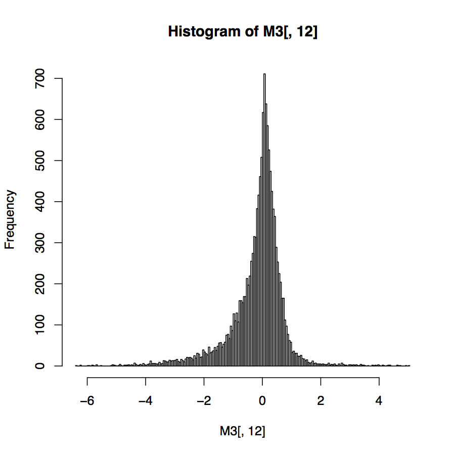

## Where might you see mixture data?  
* Flow cytometry  
* RNA-seq  
* ChIP-Seq  
* Microbiome  
* Bio

Can you think of any other types of data that might be considered a mixture?  

## What is mixture data?  
Data that does not original from a unimodal distribution.
Mixture data includes data where we can detrmine the number of components - called _finite mixture data_.  
Mixture data also includes data where the number of mixtures is equal to our number of observerations - called _infinite mixture data_.  

### Goals 
* Generate mixture data from two normal populations 
* Use expectation-maximization (EM) to determine the number of mixtures in your data
* Learn how analyze mixture data with many zeros (such as Chip-seq data) using zero-inflation
* Learn about the empiral cumulative distribition
* Learn what bootstrapping is and how to use it
* Learn about the gamma-Poisson distribution (looking at you RNA-seq-ers)
* Learn how to choose a data transformation based on a mixture model of your data  

```{r libraries, message=FALSE, warning=FALSE}
#load ALL of the libraries you will need first  
library(tidyverse)  
library(xkcd)  
library(showtext)  
library(sysfonts)  
library(Hiiragi2013)  
library(mouse4302.db)  
library(reshape2)  
library(Hmisc)    
library(ggbeeswarm)  
library(modes)  
library(RColorBrewer)  
library(ggthemes)  
library(magrittr)  
library(plotly)  
library(rgl)  
library(pheatmap)  
library(colorspace)  
library(grid)  
library(ggbio)  
library(GenomicRanges)  
library(flexmix)
library(mclust)
library(mixtools)
library(mosaics)
library(mosaicsExample)
library(here)  
library(HistData)
library(bootstrap)
library(vcd)
```

## Finite Mixtures

Let's model a finite mixture model with two equal components based on the outcomes of flipping a fair coin. 

```{r eval=TRUE}
#set seed so we always get the same outcome
set.seed(1234)
#coinflips flips a fair coin 10000 times
coinflips = (runif(10000) > 0.5)
#table of true/false (heads/tail) outcome from coinflips
table(coinflips)

#one flip generates 2 normal distributions, one from a distribution with mean=1, var=0.25 (sd=0.5), and one from a distribution with mean=3 and var=0.25
oneFlip = function(fl, mean1 = 1, mean2 = 3, sd1 = 0.5, sd2 = 0.5) {
  if (fl) {
   rnorm(1, mean1, sd1)
  } else {
   rnorm(1, mean2, sd2)
  }
}

#vairmix is generated by applying oneflip to coinflips
#if coinflips = true, run if statement (1st distribution), if false run else (2nd distribution)
fairmix = vapply(coinflips, oneFlip, numeric(1))
ggplot(tibble(value = fairmix), aes(x = value)) +
     geom_histogram(fill = "purple", binwidth = 0.1)
```

If you thought vapply was the best thing since for loops, you'll be excited to learn there's an even easier way to accomplish the above using rnorm and the ifelse command.

```{r eval=TRUE}
#set your population means to 1 and 3 
means = c(1, 3)
#set variance to 0.25 (stdev=0.5)
sds = c(0.25, 0.25)

#generate random normal distribution with length (n) equal to the length of coinflips
#if coinflips is TRUE, mean =1 and var =0.25
#if coinflips is FALSE, mean=3 and var=0.25
values = rnorm(length(coinflips),
          mean = ifelse(coinflips, means[1], means[2]),
          sd   = ifelse(coinflips, sds[1],   sds[2]))

ggplot(tibble(value = values), aes(x = value)) +
     geom_histogram(fill = "purple", binwidth = 0.1)
```

What would happen if you flipped a coin 1 million times (and also made a histogram with 500 bins to show the outcome)?  

```{r eval=TRUE}
#set the seed for sameness
set.seed(1234)
#flip that coin 1000000 times
coinflips_1000000 = (runif(1000000) > 0.5)
#table of true/false (heads/tail) outcome from coinflips
table(coinflips_1000000)

#I always reinitialize vectors and variables in case I previously messed them up 
means = c(1, 3)
sds = c(0.25, 0.25)
#rerun 
values_1000000 = rnorm(length(coinflips_1000000),
          mean = ifelse(coinflips_1000000, means[1], means[2]),
          sd   = ifelse(coinflips_1000000, sds[1],   sds[2]))

#plot it to compare
ggplot(tibble(values_1000000), aes(x = values_1000000)) +
     geom_histogram(fill = "purple", bins = 500)
```

The 2 normal distributions become more distinct with a greater number of trials. Therefore, it can be taken that a larger sample allows better approximation of the number of mixtures. 

But how does the distribution density of our 1000000 coin flips from the population with mean=1 compare to that of the density function for a normal random variable?

```{r eval=TRUE}
ggplot(dplyr::filter(tibble(values_1000000), coinflips_1000000), aes(x = values_1000000)) +
   geom_histogram(aes(y = ..density..), fill = "purple",
                  binwidth = 0.01) +
   stat_function(fun = dnorm,
          args = list(mean = means[1], sd = sds[1]), color = "red")
```

It looks pretty darn close to the denisty function of the normal distribution.  

Thus, we can write a general formula for density of any mixture model by suming the densities (proportionately).   

> f(x)=1/2ϕ1(x)+12/ϕ2(x)

```{r eval=TRUE}
fairtheory = tibble(
  x = seq(-1, 5, length.out = 1000),
  f = 0.5 * dnorm(x, mean = means[1], sd = sds[1]) +
      0.5 * dnorm(x, mean = means[2], sd = sds[2]))
ggplot(fairtheory, aes(x = x, y = f)) +
  geom_line(color = "red", size = 1.5) + ylab("mixture density")
```

Let's generate a graph for 2 sample mixture model using our knowledge of the general formula for mixture models.  

```{r eval=TRUE}
#our means and variances from above
means = c(1, 3)
sds = c(0.25, 0.25)

#why is the 0.5 in front of dnorm necessary?
#changes height, but is this necessary?
twomixmodel = tibble(
  #generate a sequence from -1 to 5 over 1000 numbers
  x = seq(-1, 5, length.out = 1000),
  f = 0.5 * dnorm(x, mean = means[1], sd = sds[1]) +
      0.5 * dnorm(x, mean = means[2], sd = sds[2]))
ggplot(twomixmodel, aes(x = x, y = f)) +
  geom_line(color = "red", size = 1.5) + ylab("mixture density")
```

Can you guess the means of the two sample mixture below. Each component has same variance. Hint: look at R code for chapter.

```{r eval=TRUE}
set.seed(1234)
mystery = tibble(
  #generate 1000 true/false statements
  coinflips = (runif(1e3) > 0.5),
  #generate
  values = rnorm(length(coinflips),
                #mean at 1 if true and 2 if false
               mean = ifelse(coinflips, 1, 2),
               #variance =0.5. std dev = ~0.7
               sd   = ifelse(coinflips, sqrt(.5), sqrt(.5))))
#generate a 30 number sequence based on the min value generated from mystery to the max num generated by mystery
br2 = with(mystery, seq(min(values), max(values), length.out = 30))
#plot
ggplot(mystery, aes(x = values)) +
geom_histogram(fill = "purple", breaks = br2)
```

Now that we know how the data was generated, we can look at the two components of the mixture.

```{r eval=TRUE}
ggplot(mystery, aes(x = values)) +
  #histogram for coinflips=true
  geom_histogram(data = dplyr::filter(mystery, coinflips),
     fill = "red", alpha = 0.2, breaks = br2) +
  #histogram for coinflips=false
  geom_histogram(data = dplyr::filter(mystery, !coinflips),
     fill = "darkblue", alpha = 0.2, breaks = br2) 
```

This doesn't look quite like our original two mixture model though. This is because in that figure the overlapping bars (purple in this figure) are plotted additively (not on top of each other).

```{r eval=TRUE}

ggplot(mystery, aes(x = values, fill = coinflips)) +
  #plot positive coin flips red
  geom_histogram(data = dplyr::filter(mystery, coinflips),
     fill = "red", alpha = 0.2, breaks = br2) +
  #plot negative coinflips blue
  geom_histogram(data = dplyr::filter(mystery, !coinflips),
     fill = "darkblue", alpha = 0.2, breaks = br2) +
  #plot the first figure we were guessing (ie. all coinflips)
  geom_histogram(fill = "purple", breaks = br2, alpha = 0.2)
```


### The Expectation-Maximization (EM) Algorithm

The EM algorithm is used to infer the value of hidden groupings.  
The EM algorithm alternates between:  
- Pretending to know the probability that each observation belongs to a component (and estimating the distribution paramaters of these components)  
- Pretending to know the distribution parameters of each component (and estimating hte probability that each observation belongs to a given component)  

A simple example:  
A variable Y is measured on a series of objects that come from two groups (but we do not know which group each object belongs to).  
- Start by augmenting the data with a latent (unobserved/hidden)
variable, called U.  
- Use the maximum likelihood approach to find the values of U and the unknown parameters of underlying densities.  
  - We will use the bivariate distribution because we are looking at the distribution of "couples" (Y,U)  
  

How would this work if applied to two unfair coings with p1=0.125, p2=0.25, probability of of picking coin 1 equal to π and probability of picking coin 2 equal to 1-π when we toss the coin twice and record the number of heads K?

```{r eval=TRUE}
#simulate 100 instances of this procedure with π=1/8 and compute the contigency table

probHead = c(0.125, 0.25)
set.seed(1234)
#compute 2 contingency tables, one for pi=1/8 and one for pi=1/4
for (pi in c(1/8, 1/4)) {
  whCoin = sample(2, 100, replace = TRUE, prob = c(pi, 1-pi))
  K = rbinom(length(whCoin), size = 2, prob = probHead[whCoin])
  print(table(K))
}
```
 
These contingecy tables look similar. Thus, it would be hard to identify the distribution parameters based on this data. This occurs when there are too many degrees of freedom in the parameters. 

*not sure how degrees of freedom are calculated*

Let's look at another example of a mixture of two normals with mean parameters unkown and standard deviation equal to 1.

```{r eval=TRUE}
#lets generate that model using R
#the labels are "u"
mus = c(-0.5, 1.5)
#randomly sample 1 or 2, 100 times, with replacement
set.seed(1234)
u = sample(2, 100, replace = TRUE)
#create a random normal distribution of 100 numbers with mean equal to -0.5(1) or 1.5(2)
y = rnorm(length(u), mean = mus[u])
#create tibble duy with mus and means
duy = tibble(u, y)
head(duy)
```

Since we know the labels "u", we can estimate the means by using seperate ML equations for each group.

```{r eval=TRUE}
duy %>% group_by(u) %>% summarise(mean(y))
```

Suppose we knew the mixing proportion was λ=1/2, so that we can calculate the so that the density by suming the denisity of the mixture proportionately. What prevents us from solving for the MLE explicitly here?

FILL IN HERE

Several R packages provide EM implementations, including mclust, EMcluster and EMMIXskew. Choose one and run the EM function several times with different starting values. Then use the function normalmixEM from the mixtools package to compare the outputs.  

```{r eval=F}
EMtest <- Mclust(duy$y, G=2)
EMtest$n
EMtest$df
EMtest$BIC
EMtest$classification
head(duy$u,20)

EMtest2 <-Mclust(duy$y*1.234, 2)
EMtest3 <-Mclust(duy$y*5, 2)
EMtest4 <-Mclust(exp(duy$y)*17, 2)

normalmixEM()
```

FILL IN HERE


### Zero inflated data

/I dislike that this section doesn't actually go over how to deal with zero inflated data. They just point you to other packages.

Biological data often comes in counts. For example, how many reads from each bacterial species were observed in a given RNA-seq sample?  

Such data can often be seen as a mixture of two scenarios: 
* If the species is not present, the count is zero.
* If the species is present, the number of individuals we observe varies, with a random sampling distribution and this distribution may also include zeros.  

The R packages pscl and zicounts provide many examples and functions for working with zero inflated counts.  

Let's look at an example of zero-inflated data from ChIP-seq. These data are sequences of pieces of DNA that are obtained from chromatin immunoprecipitation (ChIP). This technology enables the mapping of the locations along genomic DNA of transcription factors, nucleosomes, histone modifications, chromatin remodeling enzymes, chaperones, polymerases and other protein. Let's use the data measured on chromosome 22 from ChIP-Seq of antibodies for the STAT1 protein and the H3K4me3 histone modification applied to the GM12878 cell line as an example.

```{r eval=TRUE}
#construct binTFBS for chr22 data
constructBins(infile = system.file(file.path("extdata", "wgEncodeSydhTfbsGm12878Stat1StdAlnRep1_chr22_sorted.bam"), package="mosaicsExample"),
    fileFormat = "bam", outfileLoc = "../data/",
    byChr = FALSE, useChrfile = FALSE, chrfile = NULL, excludeChr = NULL,
    PET = FALSE, fragLen = 200, binSize = 200, capping = 0)
constructBins(infile = system.file(file.path("extdata", "wgEncodeSydhTfbsGm12878InputStdAlnRep1_chr22_sorted.bam"), package="mosaicsExample"),
    fileFormat = "bam", outfileLoc = "../data/",
    byChr = FALSE, useChrfile = FALSE, chrfile = NULL, excludeChr = NULL,
    PET = FALSE, fragLen = 200, binSize = 200, capping = 0)
datafiles = c("../data/wgEncodeSydhTfbsGm12878Stat1StdAlnRep1_chr22_sorted.bam_fragL200_bin200.txt",
              "../data/wgEncodeSydhTfbsGm12878InputStdAlnRep1_chr22_sorted.bam_fragL200_bin200.txt")
binTFBS = readBins(type = c("chip","input"), fileName = datafiles)
binTFBS

#create histogram for binTFBS
bincts = print(binTFBS)
ggplot(bincts, aes(x = tagCount)) +
  geom_histogram(binwidth = 1, fill = "forestgreen")
```


We can see that there are many zeroes in this data. But is the number of zeros significant given the data (look at the frequency of other small numbers)?

Let's look at the log histogram and estimate the proportion of bins with zero counts.

```{r eval=TRUE}
ggplot(bincts, aes(x = tagCount)) + scale_y_log10() +
   geom_histogram(binwidth = 1, fill = "forestgreen")

##estimate the proportion of bins with zero counts
```

## More than two components

Let's look at an example of a mixture model with more than two components. What sort of histogram do we get when when weighing N=7,000 nucleotides obtained from mixtures of deoxyribonucleotide monophosphates (each type has a different weight, measured with the same standard deviation sd=3).

```{r eval=TRUE}
masses = c(A =  331, C =  307, G =  347, T =  322)
probs  = c(A = 0.12, C = 0.38, G = 0.36, T = 0.14)
N  = 7000
sd = 3
set.seed(1234)
nuclt   = sample(length(probs), N, replace = TRUE, prob = probs)
quadwts = rnorm(length(nuclt),
                mean = masses[nuclt],
                sd   = sd)
ggplot(tibble(quadwts = quadwts), aes(x = quadwts)) +
  geom_histogram(bins = 100, fill = "purple")
```

This kind of looks like 4 separate components. What does this distribution look like compared to the theoretical density distribution?

```{r eval=TRUE}

#can generate theoretical distribution but cant get it to code on top

#generate theoretical distribution using code from figure 4.3 as example
th.density = tibble(
  th.x = seq(min(quadwts), max(quadwts), length.out = 7000),
  ds =0.12 * dnorm(th.x, mean = masses[1], sd = 3) +
      0.38 * dnorm(th.x, mean = masses[2], sd = 3) +
      0.36 * dnorm(th.x, mean = masses[3], sd = 3) +
      0.14 * dnorm(th.x, mean = masses[4], sd = 3))
ggplot() +
  geom_line(data=th.density, aes(x = th.x, y = ds), 
            color = "red", size = 1.5) + 
  ylab("mixture density")
```


What happens if we repeat this exercise with N=1000 nucleotide measurements?

```{r eval=TRUE}
N  = 1000
sd = 3
set.seed(1234)
nuclt   = sample(length(probs), N, replace = TRUE, prob = probs)
quadwts = rnorm(length(nuclt),
                mean = masses[nuclt],
                sd   = sd)
ggplot(tibble(quadwts = quadwts), aes(x = quadwts)) +
  geom_histogram(bins = 100, fill = "purple")
```

The individual components have become less distinct. Now it looks like there are only 3 separate components to this data.

What happens if we keep N=7000 measurements but make the standard deviation 10?
```{r eval=T}
N  = 7000
sd = 10
set.seed(1234)
nuclt   = sample(length(probs), N, replace = TRUE, prob = probs)
quadwts = rnorm(length(nuclt),
                mean = masses[nuclt],
                sd   = sd)
ggplot(tibble(quadwts = quadwts), aes(x = quadwts)) +
  geom_histogram(bins = 100, fill = "purple")
```

Now the individual components are even less distinct. It looks like there are only 2 components within our 4 component data.

## Empirical distributions and the nonparametric bootstrap

This type of data deals with the situation where the number of observatins is equal to the number of mixture components.

Let's use Darwin's _Zea mays_ data where he compared heights of 15 self-hybridized and 15 self-crossed plants as example.

```{r eval=T}
#look at heights of plants
ZeaMays$diff

#plot heights of plants
ggplot(ZeaMays, aes(x = diff, ymax = 1/15, ymin = 0)) +
  geom_linerange(size = 1, col = "forestgreen") + ylim(0, 0.1)
```

In general, the density of a probability distribution is the derivative (if it exists) of the empirical cumulative distribution function (ECDF).

Statistics of our sample, such as the mean, minimum or median, can also be written as a function of the ECDF.

The true sampling distribution of a statistic ^τ is often hard to know as it requires many different data samples from which to compute the statistic.

*Bootstrapping* is a method to approximate the true sample distribution of ^τ creating new samples drawn from the empirical distribution built from the original sample. 

Different samples from F lead to different data, and so to different values of the estimate ^τ: this is called sampling variability. The distribution of all the ^τ’s is the sampling distribution.

We reuse the data (by considering it a mixture distribution of δs) to create new “datasets” by taking samples and looking at the sampling distribution of the statistics ^τ∗ computed on them. This is called the _*nonparametric bootstrap approach*_.

Let's use bootstrapping to estimate the sampling distribution of the median of the Zea Mays differences. 

```{r eval=TRUE}
B = 1000
#draw 1000 samples of size 15 from the 15 values
#compute the 1000 medians of each of these samples of 15 values
set.seed(1234)
meds = replicate(B, {
  i = sample(15, 15, replace = TRUE)
  median(ZeaMays$diff[i])
})
#look at the disribution
ggplot(tibble(medians = meds), aes(x = medians)) +
  geom_histogram(bins = 30, fill = "purple")
```
Estimate a 99% confidence interval for the median based on these simulations. What can you conclude from looking at the overlap between this interval and 0?  

Use the bootstrap package to redo the same analysis using the function bootstrap for both median and mean. What differences do you notice between the sampling distribution of the mean and the median?

```{r eval=TRUE}
#create a theta function to bootstrap mean
set.seed(1234)
theta <- function(x){
  i = sample(15, 15, replace = TRUE)
  mean(ZeaMays$diff[i])
  }

#put bootstrap data into list
zea_means <- bootstrap(ZeaMays$diff, B, theta)

#plot bootstrap means
ggplot(tibble(zea_means2=zea_means$thetastar),aes(x = zea_means2))+
  geom_histogram(bins = 30, fill = "purple")
```


#### Why is this bootstrapping method called nonparametric?
Nonparametric methods are those that have infinitely many degrees of freedom or a number of unknown parameters.  

A sample does not have to have an infinite number of parameters to be become nonparametic. When the number of parameters becomes as large or larger than the amount of data available, we say the method is nonparametric.

The bootstrap uses a mixture with n components, so with a sample of size n, it qualifies as a nonparametric method


If the sample is composed of n=3 different values, how many different bootstrap resamples are possible? Answer the same question with n=15.  

FINISH LATER

What are the two types of error that can occur when using the bootstrap as it is implemented in the bootstrap package? Which parameter can you modify to improve one of them?  

1. 
2.

FINISH LATER

## Infinite Mixtures  
If the number of mixture components is as big as (or bigger than) the number of observations, we say we have an infinite mixture.  

### Infinite mixture of normals
Let's generate an infinite mixture using 2 levels of data generation.

```{r eval=T}
#level 1
#generate 10000 random deviates from the exponential distribution with rate (ie. mean) equal to 1
w = rexp(10000, rate = 1)

#level 2
#The w vector serves as the variances of normal variables with mean μ (mu) generated using rnorm
mu  = 0.3
lps = rnorm(length(w), mean = mu, sd = sqrt(w))

#plot the data
ggplot(data.frame(lps), aes(x = lps)) +
  geom_histogram(fill = "purple", binwidth = 0.1)

```
This is called a *Laplace distribution* and is useful because the median is a good estimator of its location parameter θ and that the median absolute deviation can be used to estimate its scale parameter ϕ.

#### Asymmetric laplace
In the Laplace distribution, the variances of the normal components depend on W, while the means are unaffected. A useful extension adds another parameter θ that controls the locations or centers of the components.

```{r eval=TRUE}
mu = 0.3; sigma = 0.4; theta = -1
w  = rexp(10000, 1)
alps = rnorm(length(w), theta + mu * w, sigma * sqrt(w))

#plot asymmetric laplace
ggplot(tibble(alps), aes(x = alps)) +
  geom_histogram(fill = "purple", binwidth = 0.1)
```
Hierarchical mixture distributions where every instance of the data has its own mean and variance (such as the above), are useful models in many biological settings. The length of promotors in yeast follow an asymmetric laplace distribution.



The above distribution is generated from the log-ratio of gene expression values from a microarray. How would one explain that the data have a histogram of this form?  

Most genes have a similar expression to the spike in (control) RNA. Gene expression has been downregulated to a greater degree than it has been upregulated.  

The variance of a laplace distribution is dependent on its mean (except for when mean=0, such as the case with a symmetric laplace distribution). The mean-variance relationship is common in physical measurements like microarray fluorescence intensity, mass spec peak heights or read counts from next-gen sequencing.

## Infinite mixtures of poisson variables: the gamma-poisson distribution

A two-level heierarchical model is often required to model real-world count data.  

For example, supposed we are interested in the variations of fishes in all lakes across Manitoba. We would sample the fish species in each leak to estimate their true abundance. This measurement could be modeled by a Poisson distribution. However, their true abundances will vary from lake to lake. If we were interested in examining if climate plays a role (North vs South), we would have to separate the effect of climate from the random lake to lake variation. Then we can model the Poisson rate parameters (λ) as a distribution of different rates. 

Such a hierarchical is advantageous because it allows us to add more steps in if we wish. For example, we could look at many fish species, and model environmental factors separately 

The Gamma-Poisson mixture is a two-level hierarchical model. The steps to generating at Gamma-Poisson mixture are as follows:
1. Generate a set of parameters: λ1, λ2,.. from a gamma distribution.

The gamma distribution is an extension of the (one-parameter) exponental distribution. It is positive valued and continued, and density is at a finite value.

```{r eval=TRUE}
#Let's plot some gamma distributions

#this is a gamma(2,1/3) distribution
ggplot(tibble(x = rgamma(10000, shape = 2, rate = 1/3)),
   aes(x = x)) + geom_histogram(bins = 100, fill= "purple")

set.seed(1234)
#this is a gamma(10,3/2) distribution
ggplot(tibble(x = rgamma(10000, shape = 10, rate = 3/2)),
   aes(x = x)) + geom_histogram(bins = 100, fill= "purple")
```

2. Now, let's take our gamma distribution of (10,3/2) from above and use it to generate a gamma-poisson distribution

```{r eval=TRUE}
set.seed(1234)
lambda = rgamma(10000, shape = 10, rate = 3/2)
gp = rpois(length(lambda), lambda = lambda)
ggplot(tibble(x = gp), aes(x = x)) +
  geom_histogram(bins = 100, fill= "purple")
```

As we can see, the Gamma-Poisson distribution is a discrete distribution.

Another name for the Gamma-Poisson distribution is the negative binomial distribution.

```{r eval=TRUE}
ofit = goodfit(gp, "nbinomial")
plot(ofit, xlab = "")
ofit$par
```


## Choosing a data transformation based on a mixture model of your data: variance stabilizing transformations 

In order to visual whether (and how well) we observe any true differences between our samples/replicates, we must control for the variability in our repeated measure of the same value. 

Data that are represented by a hierarchical model typically have heterogenous variances. We can stabilize this sort of variance with a transformation

Let's look at example of a square root transformation on a series of poisson distributions:  

```{r eval=TRUE}
#our lambdas for generation our poisson distributions
set.seed(1234)
lambdas = seq(100, 900, by = 100)


simdat = lapply(lambdas, function(l)
    tibble(y = rpois(n = 40, lambda=l), lambda = l)
  ) %>% bind_rows

#data without transformation
ggplot(simdat, aes(x = lambda, y = y)) +
  geom_beeswarm(alpha = 0.6, color = "purple")
#data with square root transformation
ggplot(simdat, aes(x = lambda, y = sqrt(y))) +
  geom_beeswarm(alpha = 0.6, color = "purple")
```


The graph on the left showsheteroscedasticity: the standard deviations (or, equivalently, the variance) of our data is different in different regions of our data space. In particular, it increases along the x-axis, with the mean. 

For the Poisson distribution, the standard deviation is the square root of the mean. When we apply the square root transformation to the y-variables on the right graph, then the transformed variables have approximately the same variance.

Here is the same data with our square root transformation but in a table format. 

```{r eval=TRUE}
summarise(group_by(simdat, lambda), sd(y), sd(2*sqrt(y)))
```

What happens if we repeat the above with a larger number of replicates?

```{r eval=TRUE}

set.seed(1234)
lambdas = seq(100, 900, by = 100)

simdat2 = lapply(lambdas, function(l)
    tibble(y = rpois(n = 1000, lambda=l), lambda = l)
  ) %>% bind_rows

summarise(group_by(simdat2, lambda), sd(y), sd(2*sqrt(y)))
```
There is even less variation after square root transformation.

What about a gamma-poisson distribution?

```{r eval=TRUE}
#enerate gamma-Poisson variables u
muvalues = 2^seq(0, 10, by = 1)
simgp = lapply(muvalues, function(mu) {
  u = rnbinom(n = 1e4, mu = mu, size = 4)
  tibble(mean = mean(u), sd = sd(u),
         lower = quantile(u, 0.025),
         upper = quantile(u, 0.975),
         mu = mu)
  } ) %>% bind_rows
head(as.data.frame(simgp), 2)

#and plot the 95% confidence intervals around the mean
ggplot(simgp, aes(x = mu, y = mean, ymin = lower, ymax = upper)) +geom_point() + geom_errorbar()

```
How can be transform these data to normalize their standard deviation?  

divide the values that correspond to mu[1] (and which are centered around mean[1]) by their standard deviation sd[1], the values that correspond to mu[2] (and which are centered around mean[2]) by their standard deviation sd[2], and so on, then the resulting values will have, by construction, a standard deviation (and thus variance) of 1.

```{r eval=TRUE}
simgp = mutate(simgp,
  slopes = 1 / sd,
  trsf   = cumsum(slopes * mean))
ggplot(simgp, aes(x = mean, y = trsf)) +
  geom_point() + geom_line() + xlab("")
```

## Exercises

#### Exercise 4.1 (the EM algorithm)

```{r Q1, eval=TRUE}
#load in data
yvar = readRDS("../data/Myst.rds")$yvar
#view data in histogram
ggplot(tibble(yvar), aes(x = yvar)) + geom_histogram(binwidth=0.025)
#explore the structure of the data
str(yvar)
```
```{r eval=TRUE}

#we want to model the data in yvar as a mixture of 2 normal #distributions with components A and B 

#create a random uniform distribution equal to the length of yvar (1000) with each entry equal to the probability of that data point belonging to component
pA = runif(length(yvar))
#make another numeric vector with probabilities of belonging to pB
pB = 1 - pA

#counter for iterations of the EM algorithm
iter = 0
#stores the current log-likelihood
loglik = -Inf
#stores the change in the log-likelihood from the previous iteration to the current one
delta = +Inf
tolerance = 1e-3
miniter = 50; maxiter = 1000

#run this loop until delta converges upon tolerance
#continuing running while inter is less than or equal to 1000 or less than 50 
while((delta > tolerance) && (iter <= maxiter) || (iter < miniter)) {
  #THIS IS THE E-STEP
  #lamda is the mixture fraction 
  lambda = mean(pA)
  #set mean for component A
  muA = weighted.mean(yvar, pA)
  #set mean for component B
  muB = weighted.mean(yvar, pB)
  #calculate standard deviation for component A
  sdA = sqrt(weighted.mean((yvar - muA)^2, pA))
  #calculate standard deviation for component B
  sdB = sqrt(weighted.mean((yvar - muB)^2, pB))
  
  #THIS IS THE M-STEP
  #the density of group A
  phiA = dnorm(yvar, mean = muA, sd = sdA)
  #the density of group B
  phiB = dnorm(yvar, mean = muB, sd = sdB)
  #formula for density fraction made up by A
  pA   = lambda * phiA
  #formula for density fraction made up by B
  pB   = (1 - lambda) * phiB
  #formula for density of mixture
  ptot = pA + pB
  
  pA   = pA / ptot
  pB   = pB / ptot

  loglikOld = loglik
  loglik = sum(log(pA))
  delta = abs(loglikOld - loglik)
  iter = iter + 1
}
param = tibble(group = c("A","B"), mean = c(muA,muB), sd = c(sdA,sdB))
param
iter
```
Which lines correspond to the E-step, which to the M-step?  

The basic outline of the EM procedure is as follows:  
(found on https://www.statisticshowto.datasciencecentral.com/em-algorithm-expectation-maximization/)

1. An initial guess is made for the model’s parameters and a probability distribution is created. This is sometimes called the “E-Step” for the “Expected” distribution.
2. Newly observed data is fed into the model.
3. The probability distribution from the E-step is tweaked to include the new data. This is sometimes called the “M-step.”
4. Steps 2 through 4 are repeated until stability (i.e. a distribution that doesn’t change from the E-step to the M-step) is reached.

The E-step includes the lines where we set the probability that each data point belongs to component A or B as well as the lines where we calculate lamda, muA, muB, sdA, and sdB. This step incorporates pA and pB which were revised in the M-Step.

>  lambda = mean(pA)
>  muA = weighted.mean(yvar, pA)
>  muB = weighted.mean(yvar, pB)
>  sdA = sqrt(weighted.mean((yvar - muA)^2, pA))
>  sdB = sqrt(weighted.mean((yvar - muB)^2, pB))

The maximum-likelihood estimation (MLE) is used to estimate the means for each group based on group density and mixture fraction and can be split into 2 equations and solved separately. The M-step includes:
 
>  phiA = dnorm(yvar, mean = muA, sd = sdA)
>  phiB = dnorm(yvar, mean = muB, sd = sdB)
>  pA   = lambda * phiA
>  pB   = (1 - lambda) * phiB
>  ptot = pA + pB
>  
>  pA   = pA / ptot
>  pB   = pB / ptot

What does the M-step do, what does the E-step do?

The M-step takes the "unknown" parameters generated from the E step and uses them to modify the "known" parameters (probability of belong to group A or B).

The E-step takes our known parameters (probability of belong to group A or B) and uses these parameters to generate the missing (mean, standard deviation) for our function.

What is the role of the algorithm arguments tolerance, miniter and maxiter?

Tolerance represents minimum loglikelihood required for us to be confident that we have found a suitable suitable paramaters to model our data. 

Miniter is the minimum number of times that we must interate between the E and M steps.

Maxiter is the maximum number of times we are allowed to interate between our E and M steps. If we reach Maxiter, this may suggest that are initial model (2 components) is not sufficient to explain our data.

Why do we need to compute loglik?

We need to compute loglik so that we can observe how likely we our converging between our "guessed" model of data and the best fit of our parameters. When the difference between loglik and loglikOld is very small, this suggests that we have reached our maximum and have found our best model for the data.  

Compare the results of what we are doing to the output of the normalmixEM function from the mixtools package:

```{r eval=T}
mclusttest <- Mclust(yvar, G=2)
summary(mclusttest)
mclusttest$parameters
```
This is close to the function we just generated.  

#### Exercise 4.2  

Compare the theoretical values of the gamma-Poisson distribution with parameters given by the estimates in ofit$par in Section 4.4.3 to the data used for the estimation using a QQ-plot.


```{r Q2.1, eval=T}
#x=1st rgamma from 4.4.3 using shape 2 and rate 1/3
#y=rgamma using ofit$par parameters
#set.seed(1234)
#lambda = rgamma(10000, shape = 10, rate = 3/2)
#gp = rpois(length(lambda), lambda = lambda)
#ofit = goodfit(gp, "nbinomial")
#plot(ofit, xlab = "")
#ofit$par

qqplot(y=rgamma(10000, shape=ofit$par[[1]], rate=ofit$par[[2]]),
       x=rgamma(10000, shape = 2, rate = 1/3))
```

```{r Q2.2 eval=T}
#y=rgamma using ofit$par parameters
#x=2nd rgamma from 4.4.3 using shape 10 and rate 3/2
qqplot(y=rgamma(10000, shape=ofit$par[[1]], rate=ofit$par[[2]]),
       x=rgamma(10000, shape = 10, rate = 3/2))
```

#### Exercise 4.3 (Mixture modeling examples for regression)  

The flexmix package (Grün, Scharl, and Leisch 2012) enables us to cluster and fit regressions to the data at the same time. The standard M-step FLXMRglm of flexmix is an interface to R’s generalized linear modeling facilities (the glm function).  

```{r Q3, eval=TRUE}
#load data
library(flexmix)
data("NPreg")
```

```{r Q3A, eval=TRUE}
#a) First, plot the data and try to guess how the points were generated

#what does NPreg look like
head(NPreg)
#plot x and yn for npreg
ggplot(NPreg, aes(x=x, y=yn)) +
  geom_point() #looks like a sideways X or chromosome

#count number of points
nrow(NPreg) 
nrow(na.omit(NPreg)) # no NAs
```

```{r Q3B, eval=TRUE}
#b) Fit a two component mixture model using the commands
m1 = flexmix(yn ~ x + I(x^2), data = NPreg, k = 2)
```

```{r Q3C,eval=TRUE}
#c) make a truth table that cross-classifies true classes versus cluster memberships. 

tt <- select(NPreg, class)  
tt$cluster_membership <-  m1@cluster
tt$class_equal_cluster <- ifelse(tt$class==tt$cluster_membership, TRUE, FALSE)

head(tt, 20)
```

```{r Q3D, eval=TRUE}
#What does the summary of the object m1 show us?

summary(m1)

###from the package documentation
#The summary method lists for each component the prior probability, #the number of observationsassigned to the corresponding cluster, #the number of observations with a posterior probability larger
#than eps and the ratio of the latter two numbers (which indicates #how separated the cluster is from the others)
#eps is indicated by the user or defaults to 1e-4

#the summary of m1 shows us how the data were classified prior to #fitting and how they are classified after, the summary also tells #us the log likelihood, bayesian information criteria (BIC) which #is the used to help select the statistical model (the model with #the lowest BIC is preferred), and the Akaike's Information #Criteria (AIC) which is an estimator of the statistical model #quality
```

```{r Q4, eval=TRUE}
#d) Plot the data again, this time coloring each point according to its estimated class.

#see structure of m1
str(m1)

#plot with colour based on fitting classification
ggplot(NPreg, aes(x=x, y=yn)) +
  geom_point(aes(colour=as.factor(m1@cluster)))
```


#### Exercise 4.4 (Other hierarchical noise models)  

A nonparametric Bayesian approach for clustering bisulfate-based DNA methylation profiles (PMID: 23134689)

Hierarchical probabilistic models for multiple gene/variant associations based on next-generation sequencing data (PMID: 28575251)  
The above paper is very relevant and goes over methods we discussed in this chapter.

Hierarchical cooperation of transcription factors from integration analysis of DNA sequences, ChIP-Seq and ChIA-PET data
(https://bmcgenomics.biomedcentral.com/articles/10.1186/s12864-019-5535-2)
